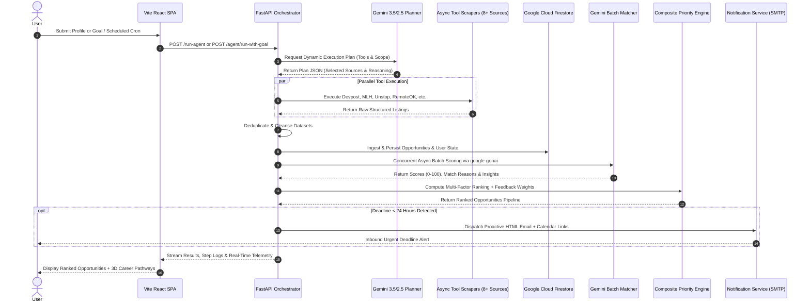

<div align="center">

# 🚀 NextLane AI
### **Autonomous Opportunity Discovery, Matching & Action Agent**

[](https://aistudio.google.com)
[](https://ai.google.dev/)
[](https://cloud.google.com/run)
[](https://cloud.google.com/firestore)
[](https://fastapi.tiangolo.com)
[](https://react.dev)

<p align="center">
  <b>An autonomous AI agent that continuously discovers, prioritizes, matches, and prepares applications for high-impact scholarships, internships, and hackathons before deadlines expire — operating independently without requiring constant user prompting.</b>
</p>

[System Architecture](#-system-architecture) • [How It Works](#-how-it-works) • [Agent Behavior](#-agent-behavior-core) • [Live Cloud Proof](#-google-cloud-deployment--proof) • [Local Setup](#-quick-start--local-setup) • [API Reference](#-api-endpoints-reference)

---

</div>

## 📌 Problem Statement

Every year, millions of students and early-career engineers miss out on life-changing scholarships, fellowships, tier-1 hackathons, and remote internships due to three systemic bottlenecks:

1. **Severe Opportunity Fragmentation:** Listings are scattered across dozens of siloed portals (Devpost, MLH, LinkedIn, Unstop, regional scholarship boards, job boards) with no standardized structure or single source of truth.
2. **The "Deadline Cliff" & Manual Searching:** Students search reactively when they have free time, discovering high-match opportunities only after the application window has closed or with $<24\text{ hours}$ left.
3. **Application Friction & Generic Submissions:** When opportunities are discovered, students lack the time or domain knowledge to rapidly tailor their CVs, draft Statements of Purpose, or align their resumes to specific evaluation criteria.

Existing solutions are either **static job boards** (requiring endless manual searching) or **passive chatbots** (waiting idly for prompts). Neither acts autonomously on behalf of the user.

---

## 💡 Solution Overview: The Autonomous Agent Model

**NextLane AI** is a **goal-driven, self-governing opportunity agent**. It does not wait for user commands. Once initialized with a user profile or strategic career goal, the agent operates autonomously in continuous background cycles:

$$\mathbf{Goal} \longrightarrow \mathbf{Plan} \longrightarrow \mathbf{Execute\ Tools} \longrightarrow \mathbf{Decide\ \&\ Prioritize} \longrightarrow \mathbf{Act}$$

```
┌──────────────────────────────────────────────────────────────────────────────────────────┐
│                                 AUTONOMOUS AGENT CYCLE                                   │
│                                                                                          │
│   [Goal / Trigger] ──► [Gemini Planner] ──► [Parallel Tool Scrapers] ──► [Firestore]     │
│                                                                             │            │
│   [Proactive Alerts] ◄── [Priority Engine] ◄── [Semantic Batch Matcher] ◄───┘            │
│           │                                                                              │
│           ▼                                                                              │
│   [Action Assistance: CV Tailoring, Statement of Purpose, 1-Click Calendar Sync]        │
└──────────────────────────────────────────────────────────────────────────────────────────┘
```

- **Autonomous Background Execution:** Runs self-directed scraping and matching sweeps on a recurring schedule without user intervention.
- **Dynamic Tool Dispatch:** Gemini evaluates candidate parameters and decides in real time which web tools and scrapers to invoke.
- **Deep Semantic Matching:** Assesses eligibility, prerequisite coverage, and career velocity — not superficial keyword searches.
- **Proactive Action Assistance:** Generates customized CV summaries, drafts motivation letters, and emails strict $<24\text{h}$ deadline alerts directly to the user's inbox.

---

## 🎯 Key Features

### 1. 🌐 Autonomous Web Discovery
- Concurrently queries and ingests data from **8+ live opportunity platforms** (Devpost, Unstop, MLH, RemoteOK, Remotive, Arbeitnow, Jobicy, LinkedIn, Scholarships360, Opportunities Corner).
- Resilient scraping pipelines equipped with exponential backoff retry logic, HTML sanitization, and automatic deduplication.

### 2. 🎯 Goal-Driven Strategic Matching
- Supports explicit high-level goals (e.g., *"Find fully-funded Master's scholarships in AI with deadlines in Q4"*) as well as implicit profile vectors.
- Evaluates academic standing, technical competencies, target countries, and prerequisite requirements via Gemini Flash.

### 3. ⚡ Multi-Attribute Priority Engine
- Calculates a composite priority score combining **Deadline Proximity**, **Semantic Match Fit**, **Goal Alignment**, and **User Feedback Weights** (rewards positive interactions, de-prioritizes dismissed categories).

### 4. 🔍 Missed Opportunity Post-Mortem Analysis
- Identifies expired opportunities the user was eligible for and generates a diagnostic debrief explaining *why* it was a strong match and prescribing proactive adjustments for the next cycle.

### 5. 🚨 Sentry Deadline Alerts ($<24\text{h}$ Strictly Filtered)
- Evaluates closing windows with strict mathematical filtering for deadlines expiring in $<24\text{ hours}$.
- Sends rich HTML notification emails with 1-click Google Calendar reminders and direct application deep-links.

### 6. 🛠️ Action Assistance: AI CV Tailoring & Letter Generator
- **CV Optimizer:** Transforms user resume bullet points and summaries to match specific opportunity requirements and keywords.
- **Letter Generator:** Drafts formal Statements of Purpose, Motivation Letters, and Academic Recommendation drafts tailored to specific programs.

---

## ⚙️ How It Works: End-to-End Pipeline



### Pipeline Steps:

1. **Trigger & Context Ingestion:** The cycle initiates either via user profile submission, an explicit strategic goal (`POST /agent/run-with-goal`), or autonomously via the 30-minute background scheduler (`APScheduler` / Cloud Scheduler).
2. **Gemini Agent Planning:** The Planner Agent inspects user skills, education level, and target objectives. It queries Gemini to dynamically formulate an execution plan specifying target tools, source priorities, and search parameters.
3. **Parallel Tool Scraping:** The orchestrator invokes verified scrapers from its `TOOL_REGISTRY` in parallel using `asyncio.gather()`, collecting listings across global hackathon platforms, scholarship databases, and remote job feeds.
4. **Data Normalization & Firestore Persistence:** Raw scraped data is sanitized, schema-validated, deduplicated against existing records, and persisted into Google Cloud Firestore collections (`opportunities`, `users`, `agent_runs`).
5. **Async Batch Semantic Matching:** The Matching Agent utilizes Gemini Flash via the official `google-genai` SDK with concurrency rate limiters to generate personalized match scores, detailed eligibility reasons (*"You match because..."*), and actionable insights.
6. **Composite Prioritization & Feedback Weighting:** The Priority Engine ranks opportunities using a weighted formula:
   $$\text{Final Priority} = (w_d \times \text{DeadlineScore}) + (w_m \times \text{MatchScore}) + (w_g \times \text{GoalAffinity}) + \Delta_{\text{Feedback}}$$
7. **Proactive Output & Action Delivery:** Results are streamed to the frontend dashboard and 3D pathway visualizer. If an opportunity deadline is strictly within $<24\text{ hours}$, the notification engine immediately dispatches an urgent HTML alert with pre-formatted Google Calendar links.

---

## 🧠 Agent Behavior (Core)

NextLane AI strictly adheres to the core tenets of autonomous agent architecture:

| Agent Dimension | Implementation in NextLane AI |
| :--- | :--- |
| **Autonomous Planning** | The `AgentPlanner` does not follow hardcoded if-else trees. It uses Gemini Flash to analyze the user's situation, determine search constraints, and select the optimal subset of tools from `AVAILABLE_TOOLS`. |
| **Tool Usage & Verification** | Tools are strictly registered in `TOOL_REGISTRY`. The agent performs function-calling-aware tool execution with parameter validation, error interception, and automatic fallback mechanisms. |
| **Decision-Making & Reasoning** | The agent performs multi-attribute evaluations: scoring technical fit, analyzing prerequisite constraints (e.g., distinguishing between Hackathon requirements vs. Scholarship CGPA/IELTS requirements), and computing deadline urgency. |
| **Memory & State Persistence** | Retains operational state across sessions using Google Cloud Firestore collections (`users`, `opportunities`, `user_feedback`, `agent_runs`), enabling adaptive learning from past user actions (`save`, `dismiss`, `apply`). |
| **Async Execution & Concurrency** | Fully non-blocking architecture using `asyncio.gather()`, background tasks, and thread-pool executor delegations for SDK calls to maintain high throughput and low latency. |

---

## 🏗️ Project Architecture & Directory Structure

```
NextLane AI/
├── .agents/                               # Antigravity agent customization workflows
│   └── workflows/
│       └── startcycle.md                 # Autonomous pipeline execution guide
├── backend/                              # FastAPI Autonomous Agent Server
│   ├── main.py                           # App entrypoint, lifespan startup, APScheduler & middleware
│   ├── config.py                         # Pydantic BaseSettings config (GCP Secret Manager + .env)
│   ├── requirements.txt                  # Python dependencies (fastapi, google-genai, firestore, etc.)
│   ├── Dockerfile                        # Cloud Run production multi-stage container
│   ├── .dockerignore                     # Docker build exclusions
│   ├── .env.example                      # Backend environment variable template
│   ├── test_scrapers.py                  # Standalone verification script for all scrapers
│   ├── validate_agent.py                 # End-to-end autonomous agent validation suite
│   ├── models/                           # Pydantic v2 data models & request/response schemas
│   │   ├── __init__.py
│   │   └── schemas.py                    # UserProfile, OpportunitySchema, AgentPlan, Requests
│   ├── routes/                           # FastAPI API Route Controllers
│   │   ├── __init__.py
│   │   ├── agent.py                      # /run-agent, /agent/plan, /agent/trace, /agent/tailor-cv
│   │   └── match.py                      # /match-all, /opportunities
│   ├── services/                         # Core Agent & Domain Services
│   │   ├── __init__.py
│   │   ├── agent_orchestrator.py         # Autonomous Master Agent (Planning, Execution, Ingestion)
│   │   ├── agent_planner.py              # Gemini goal-driven strategic planner
│   │   ├── gemini_service.py             # Google GenAI SDK wrapper (Gemini 2.5/3.5 Flash)
│   │   ├── scraping_service.py           # 8+ Live HTTP & BeautifulSoup scrapers
│   │   ├── matching_service.py           # Async batch semantic scoring orchestrator
│   │   ├── priority_engine.py            # Multi-attribute ranking & deadline proximity engine
│   │   ├── missed_analysis.py            # Post-mortem diagnostic engine for expired opportunities
│   │   ├── assistant_service.py          # AI CV Tailoring & SOP / Motivation Letter generator
│   │   ├── notification_service.py       # Proactive SMTP email alert dispatcher (<24h strict)
│   │   ├── feedback_service.py           # User feedback loop weighting (Firestore-backed)
│   │   └── firestore_service.py          # Google Cloud Firestore client + local JSON fallback
│   ├── utils/                            # Shared Utilities & Middleware
│   │   ├── __init__.py
│   │   ├── logger.py                     # Structured JSON logging with request-ID tracking
│   │   └── retry.py                      # Exponential backoff & jitter retry decorators
│   └── data/                             # Seed & Local Cache Store
│       ├── seed_opportunities.json       # Bootstrap opportunity catalog
│       └── opportunities.json            # Local runtime cache store (when Firestore is offline)
├── frontend/                             # React 19 + Vite + TypeScript Frontend
│   ├── index.html                        # Application entry HTML
│   ├── package.json                      # Frontend dependencies (React 19, Three.js, Lucide, Tailwind)
│   ├── vite.config.ts                    # Vite build configuration with React plugin
│   ├── tsconfig.json                     # TypeScript compiler configuration
│   ├── server.ts                         # Express proxy gateway & Nodemailer OTP service
│   ├── .env.example                      # Frontend environment variable template
│   └── src/                              # Source Code
│       ├── main.tsx                      # React root rendering
│       ├── App.tsx                       # Main application state machine & tab router
│       ├── index.css                     # Tailwind CSS v4 design system & glassmorphism utilities
│       ├── types.ts                      # TypeScript domain models & interfaces
│       ├── components/                   # React UI Components
│       │   ├── HeroLanding.tsx           # Interactive landing hero with live telemetry
│       │   ├── ProfileInitialization.tsx # Multi-step student profile onboarding wizard
│       │   ├── OpportunitiesFeed.tsx     # Filterable opportunity cards with AI match dials
│       │   ├── OpportunityDetailModal.tsx# Deep-dive modal with CV tailor & letter generator
│       │   ├── AutoApplyAgentModal.tsx   # 4-stage autonomous application execution simulation
│       │   ├── UrgentDeadlineModal.tsx   # Strict <24h deadline alert sentry modal
│       │   ├── MissedOpportunities.tsx   # Diagnostic post-mortem view of expired opportunities
│       │   ├── PathwaysView.tsx          # Career velocity & opportunity progression dashboard
│       │   ├── Pathways3DVisualizer.tsx  # Three.js 3D career universe node graph
│       │   ├── ThreeCanvas.tsx           # WebGL Three.js canvas container
│       │   ├── OpportunityVisualTelemetry.tsx # Radar charts & visual alignment breakdown
│       │   ├── VisualScoreArc.tsx        # Circular SVG score gauge
│       │   ├── SavedOpportunities.tsx    # Bookmarked opportunities & tracker
│       │   ├── AuthView.tsx              # OTP authentication & registration modal
│       │   ├── TopNavBar.tsx             # Header navigation bar with agent status indicator
│       │   ├── SideNavBar.tsx            # Left navigational sidebar
│       │   ├── SettingsModal.tsx         # User preferences & alert configuration
│       │   ├── ThemeToggle.tsx           # Dark / Light mode toggle
│       │   └── PremiumModal.tsx          # Tier features modal
│       └── services/                     # Frontend API Integration Services
│           ├── opportraService.ts        # Client library connecting to FastAPI backend
│           └── authService.ts            # Client-side authentication & token manager
├── cloudbuild.yaml                       # Automated Google Cloud Build CI/CD pipeline
├── gcp_free_deployment_guide.md          # 100% Free-tier Google Cloud deployment walk-through
├── details.md                            # Architecture specification & notes
└── README.md                             # Project documentation (this file)
```

---

## 💻 Tech Stack

| Domain | Technology / Library | Purpose |
| :--- | :--- | :--- |
| **AI / LLM Engine** | **Google Gemini 3.5 / 2.5 Flash** (`google-genai` SDK) | Autonomous planning, semantic match scoring, CV tailoring, letter generation |
| **Backend Framework** | **FastAPI** (Python 3.11) + **Uvicorn** | High-performance asynchronous API server with automatic OpenAPI docs |
| **Async Orchestration** | **AsyncIO** + **FastAPI BackgroundTasks** | Parallel tool execution, non-blocking batch scoring, background agent runs |
| **Scheduler** | **APScheduler** (`AsyncIOScheduler`) / **Cloud Scheduler** | Autonomous 30-minute background scraping & matching cycles |
| **Database & Memory** | **Google Cloud Firestore** (Native Mode) | Persistent cloud document storage for opportunities, profiles, feedback, and traces |
| **Data Ingestion** | **aiohttp**, **BeautifulSoup4**, **requests**, **lxml** | Resilient multi-source scraping and data extraction |
| **Cloud Hosting** | **Google Cloud Run** (Serverless Containers) | Zero-cost serverless container runtime (scale-to-zero) |
| **CI/CD Automation** | **Google Cloud Build** + **Artifact Registry** | Automated container image building and deployment pipeline |
| **Security & Secrets** | **Google Secret Manager** + **Pydantic Settings** | Centralized credential injection and environment isolation |
| **Frontend Framework** | **React 19** + **TypeScript** + **Vite 6** | Ultra-responsive, type-safe single-page application |
| **Styling & Design** | **Tailwind CSS v4** + Glassmorphism UI | Modern visual hierarchy, dark mode, responsive layout tokens |
| **3D Data Visualizer** | **Three.js** (`@types/three`) | Interactive 3D career pathway node graph visualizer |
| **Icons & Animation** | **Lucide React** + **Motion** | Fluid micro-interactions and iconography |
| **Auth & Proxy** | **Express.js** + **JWT** + **Nodemailer** / **Brevo** | OTP verification gateway and outbound email delivery |
| **Web Hosting** | **Vercel** / **Firebase Hosting** | Global edge CDN frontend deployment |

---

## 🛠️ Quick Start & Local Setup

### Prerequisites
- **Python 3.11+** installed
- **Node.js 18+** & **npm** installed
- A **Gemini API Key** from [Google AI Studio](https://aistudio.google.com/app/apikey) (Free)
- *(Optional)* Gmail App Password for SMTP alerts ([Setup Guide](https://myaccount.google.com/apppasswords))
- *(Optional)* Google Cloud Service Account JSON for Firestore ([GCP Console](https://console.cloud.google.com/))

---

### Step 1: Clone the Repository

```bash
git clone https://github.com/YasirAhmed2/NextLaneAI.git
cd NextLaneAI
```

---

### Step 2: Backend Setup

```bash
# 1. Navigate to backend directory
cd backend

# 2. Create and activate a Python virtual environment
python -m venv venv
# On Windows (PowerShell):
.\venv\Scripts\Activate.ps1
# On Linux/macOS:
source venv/bin/activate

# 3. Install dependencies
pip install --upgrade pip
pip install -r requirements.txt

# 4. Create environment configuration
cp .env.example .env
```

#### Backend Environment Variables (`backend/.env`):

```ini
# ── Google Gemini AI (Required) ───────────────────────────────────────────────
GEMINI_API_KEY="your-gemini-api-key-here"
GEMINI_MODEL="gemini-2.5-flash"

# ── FastAPI Server ────────────────────────────────────────────────────────────
PORT=8000
HOST="0.0.0.0"

# ── Authentication ────────────────────────────────────────────────────────────
JWT_SECRET="generate-a-secure-random-secret-key-32-chars-min"

# ── Email Alerts (Optional - for strictly <24h alerts) ─────────────────────────
EMAIL_USER="your-gmail-address@gmail.com"
EMAIL_PASS="your-gmail-16-char-app-password"
DASHBOARD_URL="http://localhost:5000"
BREVO_API_KEY="your-brevo-api-key-if-using-brevo"

# ── Google Cloud / Firestore (Optional - fallback to local JSON if empty) ─────
GOOGLE_APPLICATION_CREDENTIALS="path/to/service-account-key.json"
GOOGLE_CLOUD_PROJECT="your-gcp-project-id"

# ── Environment & CORS ────────────────────────────────────────────────────────
ENVIRONMENT="development"
ALLOWED_ORIGINS="http://localhost:5000,http://localhost:3000,http://127.0.0.1:5000"
LOG_FORMAT="text"
LOG_LEVEL="INFO"
```

#### Run the Backend:

```bash
uvicorn main:app --reload --host 0.0.0.0 --port 8000
```
- API Docs (Swagger UI): `http://localhost:8000/docs`
- Health Check: `http://localhost:8000/health`

---

### Step 3: Frontend Setup

```bash
# Open a new terminal in the repository root
cd frontend

# 1. Install Node dependencies
npm install

# 2. Create environment configuration
cp .env.example .env
```

#### Frontend Environment Variables (`frontend/.env`):

```ini
# Port for the Express + Vite Development Gateway
PORT=5000

# Backend FastAPI URL (Used by Express proxy to forward AI agent requests)
OPPORTRA_BACKEND_URL="http://127.0.0.1:8000"

# Public App URL
APP_URL="http://localhost:5000"

# Authentication & Email OTP Credentials
JWT_SECRET="match-the-jwt-secret-from-backend"
EMAIL_USER="your-gmail-address@gmail.com"
EMAIL_PASS="your-gmail-16-char-app-password"
```

#### Run the Frontend:

```bash
npm run dev
```
- Application Web UI: `http://localhost:5000`

---

## 📡 API Endpoints Reference

| Category | Endpoint | Method | Request Payload | Description |
| :--- | :--- | :--- | :--- | :--- |
| **Agent Execution** | `/run-agent` | `POST` | `UserProfileRequest` | Triggers the complete autonomous discovery, scraping, matching, and alerting cycle. |
| **Goal-Driven Agent** | `/agent/run-with-goal` | `POST` | `GoalDrivenAgentRequest` | Executes a strategic agent loop tailored to an explicit career or academic goal. |
| **Agent Planning** | `/agent/plan` | `POST` | `UserProfileRequest` | Queries Gemini to generate a tool selection and execution plan without scraping (dry-run). |
| **Agent Telemetry** | `/agent/trace` | `GET` | *None* | Returns the detailed execution trace, timing per phase, and step logs of the last agent run. |
| **Agent Status** | `/agent/status` | `GET` | *None* | Returns agent operational state (`idle`, `running`), total indexed opportunities, and stats. |
| **Scheduler Status** | `/agent/scheduler-status`| `GET` | *None* | Verifies the health and next execution time of the 30-minute autonomous background scheduler. |
| **Deadline Sentry** | `/agent/deadline-reminders`| `POST` | `{"email": "...", "appliedIds": []}` | Evaluates and sends urgent email alerts for opportunities closing in **strictly $<24\text{ hours}$**. |
| **Missed Analysis** | `/agent/analyze-missed`| `POST` | `AnalyzeMissedRequest` | Analyzes expired opportunities and provides diagnostic recommendations for future cycles. |
| **CV Tailoring** | `/agent/tailor-cv` | `POST` | `TailorCvRequest` | AI Assistant: Tailors CV summary, keywords, and bullet points for a specific opportunity. |
| **Letter Generator**| `/agent/generate-letter`| `POST`| `LetterGeneratorRequest` | AI Assistant: Generates customized Statements of Purpose or Recommendation Letters. |
| **User Feedback** | `/agent/feedback` | `POST` | `UserFeedbackRequest` | Persists user feedback (`save`, `dismiss`, `apply`) to adjust future ranking weights. |
| **Batch Matching** | `/match-all` | `POST` | `UserProfileRequest` | Scores user profile against all indexed opportunities via Gemini Flash. |
| **Catalog** | `/opportunities` | `GET` | *None* | Returns all currently indexed and verified opportunities in Firestore. |
| **Health Check** | `/health` | `GET` | *None* | System health status, version, active model, and autonomous mode verification. |

---

## ☁️ Google Cloud Deployment & Proof

NextLane AI is architected for zero-cost, enterprise-grade deployment on **Google Cloud Platform** using the GCP Always Free Tier.

```
┌────────────────────────────────────────────────────────────────────────────────────────┐
│                               GOOGLE CLOUD PLATFORM                                    │
│                                                                                        │
│   ┌───────────────────────────┐         ┌──────────────────────────────────────────┐   │
│   │     Google Cloud Run      │         │          Google Cloud Firestore          │   │
│   │  FastAPI Backend (Docker) │ ◄─────► │  Collections:                            │   │
│   │  • Serverless Container   │         │  • opportunities  • users                │   │
│   │  • Scale-to-Zero (0 cost) │         │  • user_feedback  • agent_runs           │   │
│   └─────────────▲─────────────┘         └──────────────────────────────────────────┘   │
│                 │                                                                      │
│   ┌─────────────┴─────────────┐         ┌──────────────────────────────────────────┐   │
│   │    Google Cloud Build     │         │          Google Secret Manager           │   │
│   │  CI/CD Automated Builds   │         │  • GEMINI_API_KEY  • JWT_SECRET          │   │
│   └───────────────────────────┘         └──────────────────────────────────────────┘   │
└────────────────────────────────────────────────────────────────────────────────────────┘
```

### 🚀 Deploying Backend to Google Cloud Run

```bash
# 1. Authenticate with GCP and set project
gcloud auth login
gcloud config set project YOUR_GCP_PROJECT_ID

# 2. Enable Google Cloud APIs
gcloud services enable \
  run.googleapis.com \
  cloudbuild.googleapis.com \
  firestore.googleapis.com \
  secretmanager.googleapis.com

# 3. Create Firestore Database in Native Mode (Free Tier)
gcloud firestore databases create --location=us-central1 --type=firestore-native

# 4. Deploy FastAPI container directly from source to Cloud Run
cd backend
gcloud run deploy nextlane-ai-backend \
  --source . \
  --region us-central1 \
  --platform managed \
  --allow-unauthenticated \
  --memory 512Mi \
  --cpu 1 \
  --min-instances 0 \
  --max-instances 3 \
  --set-env-vars "GEMINI_API_KEY=YOUR_GEMINI_API_KEY,GEMINI_MODEL=gemini-2.5-flash,ENVIRONMENT=production,ALLOWED_ORIGINS=*"
```

Upon completion, Cloud Run provides a secure HTTPS endpoint:
```text
Service [nextlane-ai-backend] revision [nextlane-ai-backend-00001] has been deployed.
Service URL: https://nextlane-ai-backend-xyz123-uc.a.run.app
```

---

### 🌐 Deploying Frontend to Vercel

```bash
cd frontend

# Deploy using Vercel CLI
npx vercel --prod
```
- Set `VITE_OPPORTRA_BACKEND_URL` in Vercel Project Settings to your Cloud Run URL:
  `https://nextlane-ai-backend-xyz123-uc.a.run.app`

---

### 🔍 Verification & Live Proof Points (For Judges)

1. **Live Health & Autonomous Verification:**
   ```bash
   curl -s https://nextlane-ai-backend-xyz123-uc.a.run.app/health
   ```
   ```json
   {
     "status": "healthy",
     "service": "nextlane-ai-backend",
     "version": "2.0.0",
     "sdk": "google-genai",
     "model": "gemini-2.5-flash",
     "autonomous": true,
     "schedulerRunning": true
   }
   ```

2. **Execution Trace Audit:**
   ```bash
   curl -s https://nextlane-ai-backend-xyz123-uc.a.run.app/agent/trace
   ```
   *Returns full timestamps, tool calls, and millisecond latencies for each phase of the agent loop.*

3. **Autonomous Scheduler Proof:**
   ```bash
   curl -s https://nextlane-ai-backend-xyz123-uc.a.run.app/agent/scheduler-status
   ```
   *Confirms scheduled runs count and next trigger time.*

---

## 🏆 Why NextLane AI Stands Out

| Standard AI Projects & Chatbots | NextLane AI Autonomous Agent |
| :--- | :--- |
| **Passive & Reactive:** Sits idle waiting for user prompts. | **Proactive & Autonomous:** Executes scheduled sweeps every 30 minutes, scraping and analyzing opportunities on its own. |
| **Static or Mock Data:** Hardcoded JSON files or mock listings. | **Live Real-World Web Ingestion:** Concurrently scrapes 8+ real platforms (Devpost, MLH, RemoteOK, LinkedIn, etc.). |
| **Generic Text Responses:** Unstructured conversational output. | **Structured Actionable Intelligence:** Returns validated schemas, eligibility matrices, visual match dials, and calendar links. |
| **No Follow-Through:** Leaves application tasks to the user. | **Full-Cycle Action Assistance:** Optimizes CVs for specific listings, drafts Statements of Purpose, and sends $<24\text{h}$ alerts. |
| **Stateless:** Forgets past interactions upon page refresh. | **Persistent Cloud Memory:** Google Cloud Firestore collections track user preferences, feedback history, and agent traces. |

---

## 🔮 Future Roadmap

- **Autonomous Form Submission Agent:** Headless browser integration (Playwright / Puppeteer agent) to automate preliminary registration forms for hackathons and scholarships with user approval gates.
- **Multi-Agent Consensus Verification:** Implement a specialized "Reviewer Agent" that cross-references scholarship legitimacy and host credentials across global academic databases.
- **Omnichannel Alerts:** Expand proactive notifications to WhatsApp Business API and Telegram bot webhooks for instant mobile alerts.

---

<div align="center">

**Built with ❤️ for the All Things Agentic Hackathon**  
*Empowering the next generation of students and builders through autonomous AI.*

</div>
